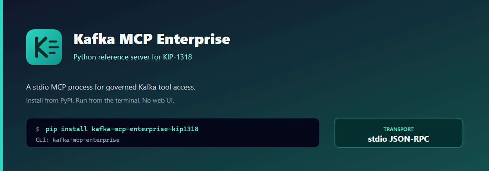
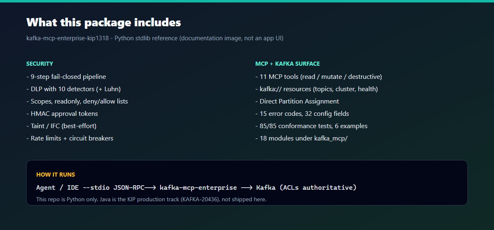
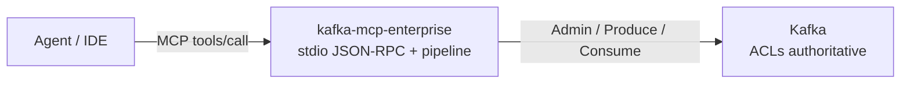
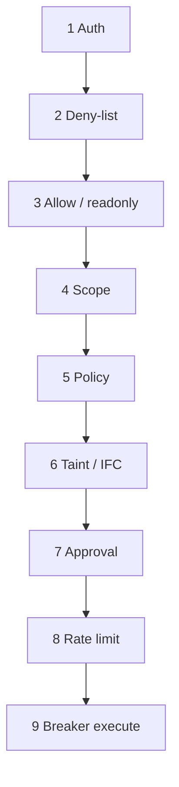
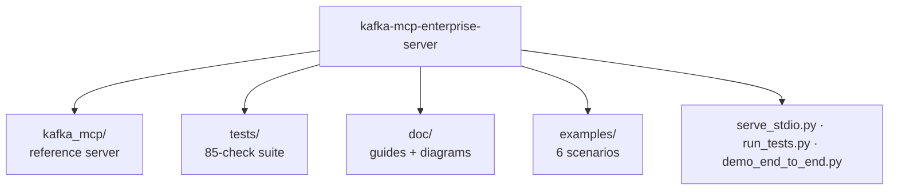

# Kafka MCP Enterprise Server

[](https://pypi.org/project/kafka-mcp-enterprise/)
[](https://pypi.org/project/kafka-mcp-enterprise/)
[](LICENSE)



*Product packaging image for the PyPI package (not a web UI).*

### Website

| | |
|---|---|
| **Site** | [https://vaquarkhan.github.io/kafka-mcp-enterprise-server/](https://vaquarkhan.github.io/kafka-mcp-enterprise-server/) |
| **Source** | [`site/`](site/) (`index.html` + local [`site/assets/site.css`](site/assets/site.css)) |
| **Deploy** | [`.github/workflows/pages.yml`](.github/workflows/pages.yml) publishes `site/` on push to `main` |

### PyPI

```bash
pip install kafka-mcp-enterprise
echo {"jsonrpc":"2.0","id":1,"method":"tools/list"} | kafka-mcp-enterprise
```

| | |
|---|---|
| **Package** | [`kafka-mcp-enterprise`](https://pypi.org/project/kafka-mcp-enterprise/) |
| **CLI** | `kafka-mcp-enterprise` |
| **Import** | `import kafka_mcp` |
| **Optional** | `pip install kafka-mcp-enterprise[otel]` |
| **Publish** | Tag `v*` → [`.github/workflows/publish.yml`](.github/workflows/publish.yml) (Trusted Publishing / OIDC - see [doc/publishing.md](doc/publishing.md)) |

### Agents & skills (Cursor, Kiro, ChatGPT, Gemini, Copilot, …)

| | |
|---|---|
| **AGENTS.md** | [`AGENTS.md`](AGENTS.md) - canonical instructions for every coding agent |
| **Skills** | [`.cursor/skills/`](.cursor/skills/) (Cursor) · [`skills/`](skills/) (portable) |
| **Guide** | [`doc/agents-and-skills.md`](doc/agents-and-skills.md) - how to load in each IDE |

---

**Reference implementation** of [**KIP-1318**](https://cwiki.apache.org/confluence/display/KAFKA/KIP-1318%3A+Model+Context+Protocol+%28MCP%29+Server+for+Apache+Kafka): a first-party [Model Context Protocol (MCP)](https://modelcontextprotocol.io/) server for Apache Kafka-secure by design, fail-closed by default, and built for agent workloads that must not become a confused deputy on your cluster.

| | |
|---|---|
| **KIP** | [KIP-1318: MCP Server for Apache Kafka](https://cwiki.apache.org/confluence/display/KAFKA/KIP-1318%3A+Model+Context+Protocol+%28MCP%29+Server+for+Apache+Kafka) |
| **Jira** | [KAFKA-20436](https://issues.apache.org/jira/browse/KAFKA-20436) - *Implement KIP-1318* |
| **Discuss** | [[DISCUSS] KIP-1318](https://www.mail-archive.com/dev@kafka.apache.org/msg155971.html) on `dev@kafka.apache.org` |
| **This repo** | Stdlib Python **reference / conformance** server (teaching, demos, security validation) |
| **KIP production target** | **Java** module (`tools/mcp-server`) wrapping native Kafka clients - see the KIP |

> **Scope clarity:** The Apache Kafka project tracks the official implementation under **KAFKA-20436**. This repository is an independent, zero-dependency **reference** that encodes the enterprise control plane, error model, and conformance tests so designs can be validated before or alongside the Java work. It is **not** a drop-in replacement for the forthcoming first-party Java MCP server.

---

## Why this exists

AI agents need governed Kafka access-not ad-hoc scripts, unbounded consumes, or shared “god” principals. KIP-1318 proposes a standalone MCP process (stdio / HTTP) that exposes tools and `kafka://` resources without changing the Kafka wire protocol. This reference implements the **full enterprise control plane** below.

Broker **ACLs remain authoritative**. Guardrails here *complement* them; they never replace them.

### What’s included



*Documentation product image (not a web UI).* Checklist of what this Python stdio reference implements: fail-closed pipeline, DLP, 11 tools, `kafka://` resources, tests, and examples.

### How it runs



**This repo:** Python stdlib reference (in-memory Kafka for tests). **KIP production track:** Java (`tools/mcp-server` / [KAFKA-20436](https://issues.apache.org/jira/browse/KAFKA-20436)), not shipped here.

### Fail-closed pipeline (overview)



Full detail: [doc/security-controls.md](doc/security-controls.md) · architecture: [doc/architecture.md](doc/architecture.md).

---

## Complete features, security controls & guardrails

Nothing below is optional marketing - every item is implemented in `kafka_mcp/` and covered by the **85/85** conformance suite and/or demos/examples unless noted as a documented reference gap.

### A. MCP protocol & surface

| Feature | Detail |
|---------|--------|
| JSON-RPC 2.0 | Strict `jsonrpc: "2.0"` request/response |
| `initialize` | `protocolVersion`, `serverInfo`, `capabilities` |
| `tools/list` | Visible tools honor deny-list, allow-list, and readonly |
| `tools/call` | Full fail-closed pipeline + handler |
| `resources/list` | Catalog of `kafka://` URIs |
| `resources/read` | Topic/cluster/group/audit/health reads |
| stdio transport | Newline-delimited JSON (`serve_stdio` / `kafka-mcp-enterprise`) |
| HTTP notes | Stateless HTTP design documented; full HTTP listener is a KIP/Java concern |
| Stateless approvals | HMAC tokens self-contained (no sticky session required for authz correctness) |
| Correlation IDs | Per-call `corr_id` on audit entries |

### B. Tools (11) - classified

| Tool | kind | module | Kafka op |
|------|------|--------|----------|
| `list_topics` | read | control_plane | DESCRIBE |
| `describe_topic` | read | control_plane | DESCRIBE |
| `describe_cluster` | read | control_plane | DESCRIBE |
| `list_consumer_groups` | read | control_plane | DESCRIBE |
| `describe_consumer_group` | read | control_plane | DESCRIBE |
| `consume_messages` | read | data_plane | READ |
| `create_topic` | mutate | control_plane | CREATE |
| `alter_topic_config` | mutate | control_plane | ALTER |
| `produce_message` | mutate | data_plane | WRITE |
| `delete_topic` | destructive | control_plane | DELETE |
| `create_acls` | destructive | control_plane | ALTER |

### C. Resources (`kafka://`)

| URI | Purpose |
|-----|---------|
| `kafka://topics` | List topics |
| `kafka://topics/{name}` | Describe topic |
| `kafka://cluster` | Cluster id + brokers |
| `kafka://groups` | Consumer groups |
| `kafka://audit/recent` | Recent audit entries |
| `kafka://health` | Liveness + per-module circuit breaker state |

### D. Fail-closed security pipeline (exact order)

Every `tools/call` - **first denial wins**:

| Step | Control | Denial code |
|------|---------|-------------|
| 1 | **Bearer auth** - audience / issuer validation (off until configured) | `-32001` UNAUTHORIZED |
| 2 | **Deny-list** (`tools_denied`) | `-32044` POLICY_DENIED |
| 3 | **Allow-list** (`tools_allowed`) + **readonly** (blocks all non-read, including produce) | `-32044` |
| 4 | **Topic prefix scope** + **group prefix scope** | `-32041` SCOPE_VIOLATION |
| 5 | **Policy engine** - callable; deny **or** exception → fail-closed | `-32044` |
| 6 | **Taint guard / IFC** - destructive tools; optional `ifc_strict`; approval bypasses | `-32040` TAINT_VIOLATION |
| 7 | **Approval gate** - HMAC signed TTL token (`_approval_token`) | `-32042` APPROVAL_REQUIRED |
| 8 | **Rate limit** - general vs admin/control-plane buckets | `-32029` RATE_LIMITED |
| 9 | **Execute** via per-module **circuit breaker** + dependency check | `-32043` DEPENDENCY_UNAVAILABLE |

**Pre / around execute (also enforced):**

| Guardrail | Behavior | Code |
|-----------|----------|------|
| Input validation | Identifier charset; `max_value_bytes` on produce values | `-32046` VALIDATION_FAILED |
| Rogue-agent kill-switch | Per-identity destructive burst → quarantine | `-32047` QUARANTINED |
| Identity propagation | Optional per-principal broker ACL check before execute | `-32044` |
| Sensitive-topic gating | Pattern match on consume → requires approval | `-32042` |
| Egress DLP | Block secret categories on produce | `-32045` SENSITIVE_DATA_BLOCKED |
| Dry-run tools | `dryrun_tools` returns plan without mutation | - |
| Consume clamp | `maxMessages` capped by `hard_max_records` | - |
| Byte bounds | `hard_max_bytes` trims consume payload; `max_output_bytes` truncates scrubbed output | truncation tags |
| Post-execute DLP scrub | Redact/scrub whole result tree | - |
| Taint registration | Consumed values registered into session taint set | - |
| Audit | ALLOW/DENY recorded (params truncated, hash-chained) | - |

### E. Data-protection guardrails (DLP)

| Capability | Detail |
|------------|--------|
| Modes | `redact` \| `block` \| `off` (`dlp_mode`) |
| Default block categories | `private_key`, `aws_access_key`, `jwt` |
| Detectors (10) | email, ssn, **credit_card (Luhn-validated)**, phone, ipv4, aws_access_key, private_key, jwt, iban, secret_assignment |
| Consume path | Redact PII in records; block-mode can refuse | 
| Produce path | Egress scan → `-32045` |
| Sensitive configs | Mask password/secret-like keys on describe (`redact_sensitive_configs`) |
| Scrub all outputs | Walk entire JSON result (`scrub_all_outputs`) |
| Legacy interceptor | `interceptor.redact_record` kept for compatibility; DLP is primary |

### F. Approval, taint & IFC

| Capability | Detail |
|------------|--------|
| HMAC approval tokens | `mint` / `verify`; TTL (default 300s); tool-bound |
| Forged / expired tokens | Rejected → `-32042` |
| Default approval-required tools | `delete_topic`, `delete_records`, `create_acls`, `delete_acls`, `alter_partition_reassignments`, `alter_broker_config` |
| Taint guard | Best-effort substring match of session tainted values into destructive args |
| `ifc_strict` | After untrusted read, blocks destructive/control-plane without approval |
| Honesty | Taint is **defeatable by laundering**; least-privilege **broker ACLs** are load-bearing |

### G. Scoping, exposure & identity

| Capability | Detail |
|------------|--------|
| Tool allow-list / deny-list | `tools_allowed`, `tools_denied` |
| Secure-by-default guidance | Ops should set allow-list to read/non-destructive (harness default `*` - tighten in prod) |
| Readonly mode | Disables create/produce/alter/delete/ACLs |
| Topic prefixes | `allowed_topic_prefixes` |
| Group prefixes | `allowed_group_prefixes` |
| Identity propagation | `identity_propagation` + in-memory per-principal ACLs (`set_principal_acl` / `authorize`) |
| Session identity | `session["identity"]` for audit, quarantine, ACL principal |

### H. Resilience & blast-radius controls

| Capability | Detail |
|------------|--------|
| Circuit breakers | Per module: `data_plane`, `control_plane`, `ecosystem` |
| Breaker isolation | Control-plane open does not take down data-plane consume/produce |
| Dependency failure hook | `_inject_dependency_failure` / `_fail_module` → `-32043` |
| Rate limits | `rate_requests_per_second` + `rate_admin_requests_per_second` |
| Quarantine | `max_destructive_per_minute` per identity |
| Health resource | Breaker states on `kafka://health` |

### I. Consume semantics (Direct Partition Assignment)

| Mode | Behavior |
|------|----------|
| No `groupId` | `assignment=direct`, **no consumer group**, **no rebalance** |
| With `groupId` | Classic group path; register offsets; rebalance counter increments |

### J. Backend surface (in-memory Kafka)

`create_topic`, `delete_topic`, `list_topics`, `describe_topic`, `alter_topic_config`, `produce`, `consume`, `list_groups`, `describe_group`, `group_lag`, `create_acls`, `list_acls`, `describe_cluster`, principal ACLs, rebalance counter, dependency hooks.

### K. Audit

| Capability | Detail |
|------------|--------|
| Ring buffer | Recent entries (`maxlen=1000`) |
| Hash chaining | Tamper-**resistant** best-effort chain |
| Param truncation | Long params truncated (>64 chars) |
| Decisions | `ALLOW` / `DENY` with identity, tool, corr_id |
| Resource | `kafka://audit/recent` |
| `audit_topic` | Config name present; durable Kafka mirror is a documented reference gap |

### L. Error codes (complete - 15)

| Code | Constant | Meaning |
|------|----------|---------|
| -32700 | PARSE_ERROR | JSON parse error |
| -32600 | INVALID_REQUEST | Invalid request |
| -32601 | METHOD_NOT_FOUND | Unknown method/tool |
| -32602 | INVALID_PARAMS | Invalid params / structured Kafka errors |
| -32603 | INTERNAL_ERROR | Internal error |
| -32001 | UNAUTHORIZED | Bad/missing bearer |
| -32029 | RATE_LIMITED | Rate limited |
| -32040 | TAINT_VIOLATION | Tainted value into destructive tool |
| -32041 | SCOPE_VIOLATION | Topic/group out of scope |
| -32042 | APPROVAL_REQUIRED | Destructive/sensitive needs approval |
| -32043 | DEPENDENCY_UNAVAILABLE | Circuit breaker open / dependency down |
| -32044 | POLICY_DENIED | Deny/allow/readonly/policy/ACL propagation |
| -32045 | SENSITIVE_DATA_BLOCKED | Egress / DLP block |
| -32046 | VALIDATION_FAILED | Malformed identifier / oversized value |
| -32047 | QUARANTINED | Rogue-agent kill-switch |

### M. Configuration surface (32 fields)

`bootstrap_servers`, `transport`, `tools_allowed`, `tools_denied`, `readonly`, `allowed_topic_prefixes`, `allowed_group_prefixes`, `taint_guard_enabled`, `approval_required_tools`, `dryrun_tools`, `audit_topic`, `policy_engine`, `circuit_breaker_enabled`, `dependency_timeout_ms`, `rate_requests_per_second`, `rate_admin_requests_per_second`, `oauth_expected_audience`, `oauth_expected_issuer`, `approval_signing_secret`, `redaction_enabled`, `dlp_mode`, `dlp_block_categories`, `scrub_all_outputs`, `redact_sensitive_configs`, `sensitive_topic_patterns`, `max_value_bytes`, `max_output_bytes`, `max_destructive_per_minute`, `ifc_strict`, `hard_max_records`, `hard_max_bytes`, `identity_propagation`.

Full defaults: [doc/configuration.md](doc/configuration.md).

### N. Quality, packaging & agent DX

| Feature | Detail |
|---------|--------|
| Conformance suite | **85/85** checks (functional, security, guardrails, mechanisms, resources, stdio, audit hardening) |
| Smoke + demo | `test_kafka_mcp.py` (16), `demo_end_to_end.py` (22 steps, all security codes) |
| Examples | Six folders with real-world `data/` fixtures |
| PyPI | `kafka-mcp-enterprise` · CLI `kafka-mcp-enterprise` |
| Stdlib-only core | No hard third-party deps |
| Optional OTel | `pip install …[otel]` - not required ([doc/observability.md](doc/observability.md)) |
| AGENTS.md + skills | Cursor / Kiro / Copilot / ChatGPT / Gemini ([doc/agents-and-skills.md](doc/agents-and-skills.md)) |

### O. Documented reference gaps (intentional)

HTTP full server · real brokers · HTTP policy URL client · durable `audit_topic` publish · wall-clock `dependency_timeout_ms` · some approval tool *names* reserved but not all registered · production language = **Java** (this package is the Python reference). See [doc/kip-alignment.md](doc/kip-alignment.md).

---

## Quick start

Requires **Python 3.8+**. Core has **no third-party packages**.

```bash
# From source
python run_tests.py
python demo_end_to_end.py
python examples/01_sre_readonly_triage/run.py
echo {"jsonrpc":"2.0","id":1,"method":"tools/list"} | python serve_stdio.py
```

See the **PyPI** section at the top for `pip install`, or [doc/publishing.md](doc/publishing.md) to publish a release.

---

## Documentation & examples

| Resource | Description |
|----------|-------------|
| **[doc/](doc/README.md)** | End-to-end guides: getting started, architecture, security, config, tools, errors, testing |
| **[doc/kip-alignment.md](doc/kip-alignment.md)** | Feature matrix vs KIP-1318 - what is implemented vs intentional reference gaps |
| **[doc/publishing.md](doc/publishing.md)** | PyPI package `kafka-mcp-enterprise` |
| **[doc/observability.md](doc/observability.md)** | OpenTelemetry: optional, not required |
| **[doc/agents-and-skills.md](doc/agents-and-skills.md)** | AGENTS.md + skills for all IDEs |
| **[examples/](examples/README.md)** | Six folder-based scenarios (`run.py` + real-world `data/` fixtures) |

---

## Repository layout



---

## Engineering standards

This reference aims at **production-grade practice** even while staying a teaching implementation:

| Practice | How it shows up |
|----------|-----------------|
| **Fail-closed** | First denial wins; no execute-then-check paths |
| **Least privilege** | Prefix scopes, allow/deny lists, readonly, approval for destructive ops |
| **Defense in depth** | MCP controls + explicit honesty that **broker ACLs** are load-bearing |
| **Bounded blast radius** | Hard record/byte caps, rate limits, per-plane breakers, quarantine |
| **Observable denials** | Stable error codes, correlation IDs, audit ALLOW/DENY |
| **Testability** | Deterministic in-memory backend; security + integration coverage |
| **Zero dependency debt** | Python **stdlib only** - easy to audit and run in CI |
| **Clear product boundary** | Official Kafka delivery tracked on **KAFKA-20436** (Java) |

### Honest limitations (by design)

- **Taint / IFC is best-effort** - defeatable by data laundering; do not treat as complete mediation.  
- **In-memory Kafka** - validates control logic; not a broker client.  
- **stdio-first** - HTTP is specified in the KIP; this reference documents notes, full HTTP is a Java/production concern.  
- **Secure-by-default in ops** - tighten `tools_allowed` to read/non-destructive in real deployments (see configuration guide).

---

## Related links

- **KIP-1318 (wiki):** https://cwiki.apache.org/confluence/display/KAFKA/KIP-1318%3A+Model+Context+Protocol+%28MCP%29+Server+for+Apache+Kafka  
- **Jira:** https://issues.apache.org/jira/browse/KAFKA-20436  
- **MCP specification:** https://modelcontextprotocol.io/  

---

## License & affiliation

Apache Kafka, KIP-1318, and KAFKA-20436 are trademarks / projects of the Apache Software Foundation. This repository is a **community reference** aligned with that proposal; it is not the official ASF deliverable unless and until merged under the Kafka project.
