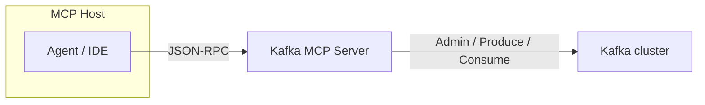

# Architecture

## Trust boundaries

The **host** mediates the agent. The **MCP server** applies policy, bounds, and scrubbing. **Broker ACLs** remain the authoritative authorization layer (optionally via identity propagation).

## Package map

| Module | Role |
|--------|------|
| `server.py` | JSON-RPC dispatch + full pipeline wiring |
| `security.py` | Deny/allow/readonly, scope, policy, taint, approval |
| `guardrails.py` | Validation, egress DLP, sensitive topics, quarantine |
| `dlp.py` | Detectors (incl. Luhn), redact/block modes |
| `backend.py` | In-memory Kafka + Direct Partition Assignment + ACLs |
| `resilience.py` | Rate limiter + per-module circuit breakers |
| `approval.py` | HMAC signed TTL tokens |
| `audit.py` | Hash-chained recent audit buffer |
| `tools.py` / `resources.py` | MCP tool registry + `kafka://` handlers |
| `transport.py` | stdio NDJSON loop |

## Direct Partition Assignment

Ephemeral agent peeks should **not** join a consumer group:

| Call | Behavior |
|------|----------|
| `consume_messages` without `groupId` | `assignment=direct`, **no group**, **no rebalance** |
| `consume_messages` with `groupId` | Classic group path; rebalance counter increments |

This avoids agent-driven rebalance storms on shared clusters.

## Module isolation

Tools are tagged `data_plane` / `control_plane` / `ecosystem`. Each plane has its own **circuit breaker**. A failing admin dependency can open `control_plane` while `consume_messages` on `data_plane` keeps serving.

Health: `resources/read` → `kafka://health`.

## Stateless transports

stdio and HTTP (notes in `transport.py`) are protocol-stateless. Approval tokens are self-contained. In-process taint sets are **best-effort** and must not be relied on across hosts.

> **Reference note:** this package implements **stdio** end-to-end. A full HTTP listener is out of scope for the teaching server (see [kip-alignment.md](kip-alignment.md)).
