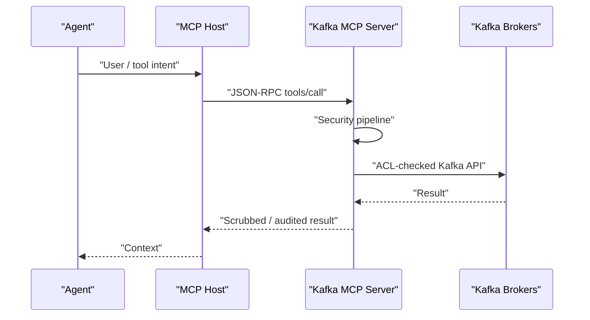
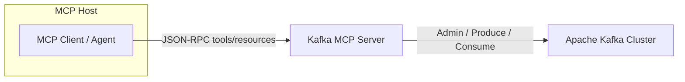
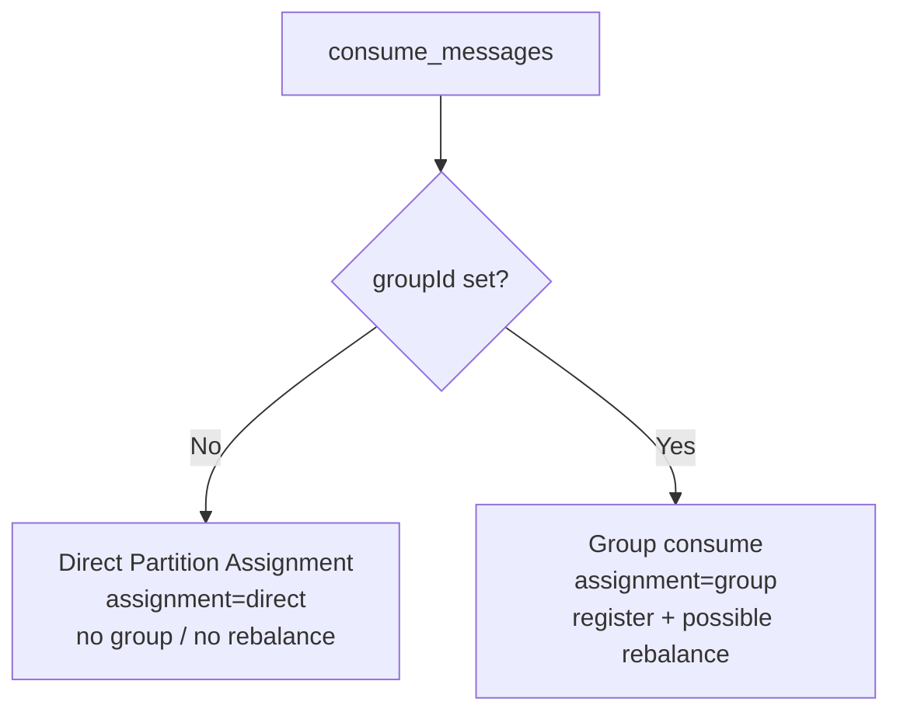

# Architecture

This Python package is the **KIP-1318 reference / validation** implementation (stdlib, in-memory Kafka). The KIP’s **production** recommendation remains **Java** (`tools/mcp-server` under [KAFKA-20436](https://issues.apache.org/jira/browse/KAFKA-20436)).

Public docs include the **5** Mermaid diagrams from the KIP (architecture, client-host-server, Direct Partition Assignment here; security pipeline and data-to-tool defense in [security-controls.md](security-controls.md)).

---

## Diagram 1 - MCP client-host-server

**What it shows:** Host mediates; server enforces the control pipeline; brokers authorize.  
**Why it matters:** Clarifies trust boundaries for enterprise reviewers.

---

## Diagram 2 - Architecture (host → server → Kafka)

**What it shows:** Agent traffic terminates at the MCP server; Kafka remains the system of record.  
**Why it matters:** Security and bounds are enforced at the MCP edge without replacing broker ACLs.

The **host** mediates the agent. The **MCP server** applies policy, bounds, and scrubbing. **Broker ACLs** remain the authoritative authorization layer (optionally via identity propagation).

---

## Package map

| Module | Role |
|--------|------|
| `server.py` | JSON-RPC dispatch + full pipeline wiring |
| `security.py` | Deny/allow/readonly, scope, policy, taint, approval |
| `guardrails.py` | Validation, egress DLP, sensitive topics, quarantine |
| `dlp.py` | Detectors (incl. Luhn), redact/block modes |
| `backend.py` | In-memory Kafka + Direct Partition Assignment + ACLs |
| `resilience.py` | Rate limiter + per-module circuit breakers |
| `approval.py` | HMAC signed TTL tokens |
| `audit.py` | Hash-chained recent audit buffer |
| `tools.py` / `resources.py` | MCP tool registry + `kafka://` handlers |
| `transport.py` | stdio NDJSON loop |

---

## Diagram 5 - Direct Partition Assignment vs group path

Ephemeral `consume_messages` **without** `groupId` uses Direct Partition Assignment: no group membership, **no rebalance**. With `groupId`, classic group consume applies.

**What it shows:** Two consume paths for agent vs long-lived group workloads.  
**Why it matters:** Prevents ephemeral agent sessions from causing consumer-group storms.

| Call | Behavior |
|------|----------|
| `consume_messages` without `groupId` | `assignment=direct`, **no group**, **no rebalance** |
| `consume_messages` with `groupId` | Classic group path; rebalance counter increments |

---

## Module isolation

Tools are tagged `data_plane` / `control_plane` / `ecosystem`. Each plane has its own **circuit breaker**. A failing admin dependency can open `control_plane` while `consume_messages` on `data_plane` keeps serving.

Health: `resources/read` → `kafka://health`.

## Stateless transports

stdio and HTTP (notes in `transport.py`) are protocol-stateless. Approval tokens are self-contained. In-process taint sets are **best-effort** and must not be relied on across hosts.

> **Reference note:** this package implements **stdio** end-to-end. A full HTTP listener is out of scope for the teaching server (see [kip-alignment.md](kip-alignment.md)).
