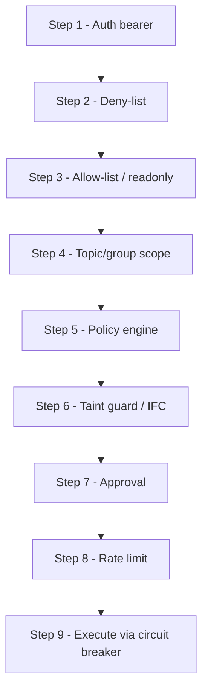
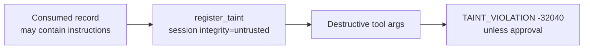

# Security controls

This document covers the fail-closed control plane for the **Python KIP-1318 reference**. Production deployments of the official server are expected in **Java** per the KIP; this repo validates the security model and conformance suite.

Diagrams **3** (pipeline) and **4** (data-to-tool defense) live here. Diagrams **1**, **2**, and **5** are in [architecture.md](architecture.md).

---

## Diagram 3 - Security control evaluation pipeline (fail-closed)

Every `tools/call` runs this order; **first denial wins**:

**What it shows:** Fail-closed control evaluation order.  
**Why it matters:** First denial wins; no “execute then check” paths.

| Step | Control | Denial code |
|------|---------|-------------|
| 1 | Auth - bearer audience/issuer when configured | `-32001` |
| 2 | Deny-list | `-32044` |
| 3 | Allow-list / readonly (blocks writes incl. produce) | `-32044` |
| 4 | Topic / group prefix scope | `-32041` |
| 5 | Policy engine - fail-closed on deny or exception | `-32044` |
| 6 | Taint / IFC - destructive; approval bypasses | `-32040` |
| 7 | Approval - HMAC signed TTL token | `-32042` |
| 8 | Rate limit - general vs admin buckets | `-32029` |
| 9 | Execute via per-module circuit breaker | `-32043` |

Additional guards around execute:

- Input validation (`-32046`)
- Rogue-agent quarantine (`-32047`)
- Egress DLP on produce (`-32045`)
- Sensitive-topic gating on consume
- Post-execute DLP scrub + audit ALLOW/DENY

---

## Diagram 4 - Data-to-tool escalation defense

**What it shows:** Indirect prompt injection into tool args is checked via taint.  
**Why it matters:** Raises the bar for data→action escalation; not a substitute for ACLs.

---

## Secure-by-default guidance

In production, set `tools_allowed` to **read / non-destructive** tools only. Enable `delete_topic`, `create_acls`, etc. explicitly and keep them on `approval_required_tools`.

## Honesty (important)

| Control | Reality |
|---------|---------|
| Taint / IFC | **Best-effort** - can be defeated by data laundering |
| Broker ACLs | **Load-bearing** - least privilege at the cluster |
| MCP guardrails | **Complement** broker authz; they do not replace it |
| Audit hash chain | Tamper-**resistant** in-memory; export for true retention |
| Language split | **Python** = this reference/validation package; **Java** = KIP production target |

## DLP

Ten detectors (email, SSN, Luhn credit card, phone, IPv4, AWS key, private key, JWT, IBAN, secret assignment). Modes: `redact` | `block` | `off`. Default block categories: `private_key`, `aws_access_key`, `jwt`.
